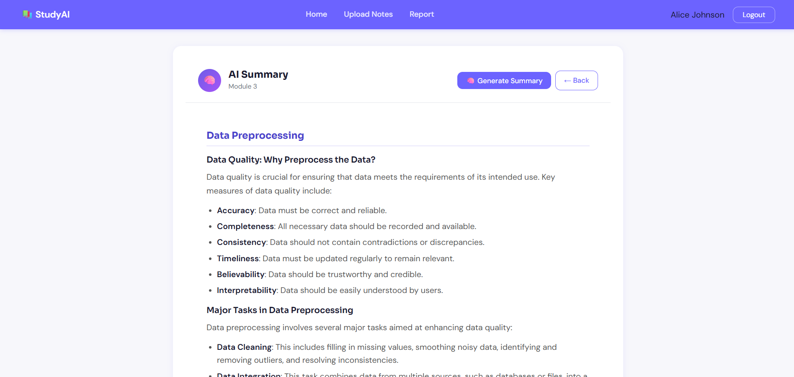
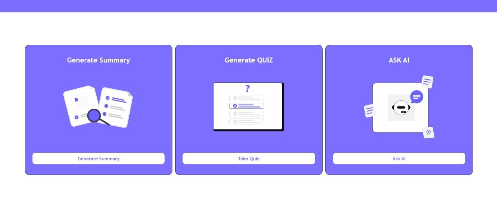
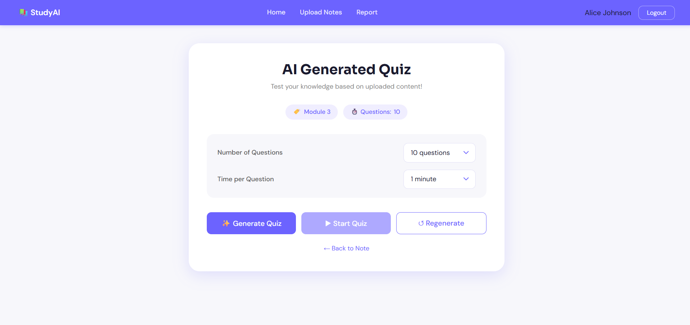
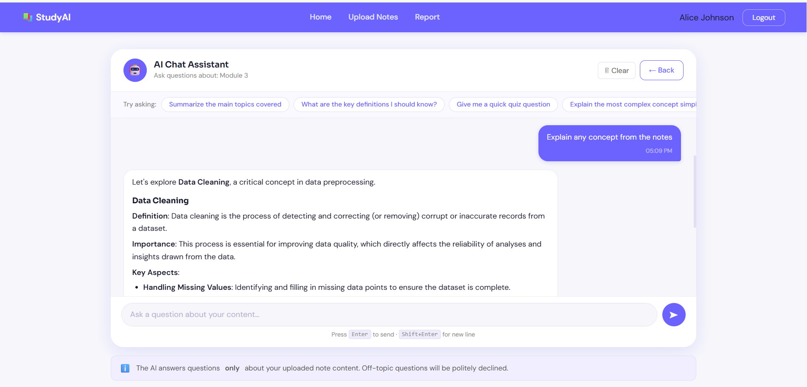

# 📚 Smart Study Companion
### An AI-Powered Study Tool

> Reimagine how you study. Upload your notes, get instant AI summaries, take adaptive quizzes, and chat with an AI that knows your material — all in one seamless platform.

---

## 🎯 About the Project

**Smart Study Companion** is a full-stack web application that helps students study smarter by combining AI automation with a clean, intuitive interface. Upload your study materials (PDF or text) and instantly get:

- 🧠 **AI-generated summaries** of your notes
- 📝 **Auto-generated quizzes** to test your knowledge
- 💬 **AI Chat Assistant** scoped strictly to your uploaded content
- 📊 **Progress tracking** across all your quiz attempts

Built as a **Web Technologies** academic project, it demonstrates real-world integration of AI, web development, and database management.

---

## ✨ Features

| Feature | Description |
|---|---|
| 📂 **PDF & Notes Upload** | Upload PDF, TXT, or MD files — text is extracted automatically |
| 🧠 **AI Summaries** | Generate structured, student-friendly summaries of your notes |
| 📝 **Interactive Quizzes** | Auto-generated multiple-choice questions with timer and scoring |
| 💬 **AI Chat Assistant** | Ask questions — AI answers only from your uploaded content |
| 📊 **Learning Report** | Track quiz history, average scores, and score trends |
| 🔐 **Secure Auth** | JWT-based login/signup with bcrypt password hashing |
| ⚡ **Summary Caching** | Generated summaries are cached — no repeat API calls |

---

<!-- ## 🖼️ Screenshots

| Page | Description |
|---|---|
| **Login** | Split-card login with sign up tab |
| **Dashboard** | Notes grid with search and sort |
| **View Note** | File info + content preview + AI action buttons |
| **Summary** | AI-generated markdown summary with copy/download |
| **Quiz** | Timed MCQ quiz with score result |
| **Chat** | Context-aware AI chat scoped to your note |
| **Report** | Quiz history, stats, and score trend bar chart | -->


## 🖼️ Screenshots

### 🔐 Login & Registration

<p align="center">
  
</p>

The authentication page provides secure login and registration with a clean modern interface.

---

### 🏠 Dashboard

<p align="center">
  
</p>

The dashboard serves as the central hub where students can access uploaded notes, quizzes, reports, and AI-powered study tools.

---

### 📖 AI Summary Generation

<p align="center">
  
</p>

Generate structured summaries from uploaded notes, helping students quickly revise important concepts.

---

### 🚀 Study Tools

<p align="center">
  
</p>

Access three AI-powered learning tools:

- 🧠 Generate Summary
- 📝 Generate Quiz
- 💬 Ask AI

---

### 📝 AI Quiz Generator

<p align="center">
  
</p>

Create quizzes automatically from uploaded content and test understanding with configurable question counts and timing.

---

### 💬 AI Chat Assistant

<p align="center">
  
</p>

Ask questions about uploaded notes and receive context-aware answers generated exclusively from your study material.
---

## 🛠️ Tech Stack

### Frontend
- **HTML5**, **CSS3**, **Vanilla JavaScript**
- Custom CSS with CSS Variables (no framework)
- Google Fonts — Sora + DM Sans

### Backend
- **PHP 8.2** — REST API endpoints
- **Python 3.10+** — AI script layer
- **MySQL 8.0** — Database

### AI Integration
- **OpenAI API** (`gpt-4o-mini`) — Summaries, Quizzes, Chat
  > *(or swap to Ollama for 100% local/offline AI — see configuration)*

### Authentication
- **JWT** (JSON Web Tokens) — HS256, pure PHP implementation
- **bcrypt** (cost 12) — password hashing

### PDF Extraction
- **pdfplumber** (primary)
- **pypdf** (fallback)
- **pdfminer.six** (deep fallback)

### Version Control
- **Git & GitHub**

---

## 📁 Project Structure

```
SmartStudyCompanion/
│
├── ai/                          # Python AI scripts
│   ├── openai_client.py         # Shared AI client (OpenAI or Ollama)
│   ├── generate_summary.py      # Summary generation
│   ├── generate_quiz.py         # Quiz question generation
│   ├── chat_assistant.py        # Context-aware chat
│   ├── extract_pdf.py           # PDF text extraction
│   └── requirements.txt         # Python dependencies
│
├── backend/
│   ├── ai/                      # PHP → Python bridge endpoints
│   │   ├── generate_summary.php
│   │   ├── generate_quiz.php
│   │   └── chat_assistant.php
│   ├── auth/                    # Authentication endpoints
│   │   ├── login.php
│   │   ├── signup.php
│   │   ├── logout.php
│   │   └── verify_token.php
│   ├── config/                  # Shared PHP config
│   │   ├── db.php               # PDO database connection
│   │   ├── cors.php             # CORS headers
│   │   └── jwt_helper.php       # JWT generation/validation
│   ├── notes/                   # Note CRUD endpoints
│   │   ├── upload_note.php
│   │   ├── get_notes.php
│   │   ├── get_note_by_id.php
│   │   ├── delete_note.php
│   │   └── rename_note.php
│   └── quiz/                    # Quiz result endpoints
│       ├── save_result.php
│       └── get_results.php
│
├── database/
│   ├── schema.sql               # Full database schema (run first)
│   └── seed.sql                 # Demo data (optional)
│
frontend/
│
├── assets/
│   ├── css/
│   │   ├── style.css
│   │   ├── dashboard.css
│   │   ├── login.css
│   │   ├── quiz.css
│   │   ├── report.css
│   │   ├── summary.css
│   │   ├── upload.css
│   │   ├── view-note.css
│   │   └── chat.css
│   │
│   ├── js/
│      ├── auth.js
│      ├── dashboard.js
│      ├── upload.js
│      ├── summary.js
│      ├── quiz.js
│      ├── chat.js
│      ├── report.js
│      ├── note-view.js
│      ├── api.js
│      └── utils.js
│      
│── index.html
│── login.html
│── signup.html
│── dashboard.html
│── upload.html
│── summary.html
│── quiz.html
│── report.html
│── chat.html
│── view-note.html
│
├── uploads/                     # Uploaded files (auto-created)
├── .env                         # Your config (never commit this)
├── .env.example                 # Config template (commit this)
├── .gitignore
└── README.md
```

---

## ⚙️ Installation & Setup

### Prerequisites

- **XAMPP** (Apache + PHP 8.2 + MySQL) or equivalent
- **Python 3.10+**
- **Git**
- **OpenAI API key** — [get one here](https://platform.openai.com/api-keys)

---

### Step 1 — Clone the repository

```bash
git clone https://github.com/your-username/SmartStudyCompanion.git
cd SmartStudyCompanion
```

---

### Step 2 — Install Python dependencies

```bash
pip install -r ai/requirements.txt
```

Required packages:
```
openai>=1.0.0
pdfplumber>=0.11.0
pypdf>=4.0.0
pdfminer.six>=20231228
python-dotenv>=1.0.0
```

---

### Step 3 — Set up the database

Start MySQL (via XAMPP or your MySQL server), then run:

```bash
mysql -u root -p < database/schema.sql
```

Optionally load demo data:
```bash
mysql -u root -p smart_study_companion < database/seed.sql
```

Demo accounts (from seed.sql):

| Email | Password |
|---|---|
| alice@studyai.com | Password@123 |
| bob@studyai.com | Password@123 |
| carol@studyai.com | Password@123 |

---

### Step 4 — Configure environment variables

```bash
cp .env.example .env
```

Edit `.env` with your values:

```env
# Database
DB_HOST=localhost
DB_PORT=3306
DB_NAME=smart_study_companion
DB_USER=root
DB_PASSWORD=your_mysql_password

# JWT Secret — generate with: openssl rand -hex 64
JWT_SECRET=your_64_char_random_secret_here
JWT_EXPIRY_SECONDS=86400

# CORS
ALLOWED_ORIGIN=http://localhost:8000

# OpenAI API
OPENAI_API_KEY=sk-your_openai_key_here
OPENAI_MODEL=gpt-4o-mini
OPENAI_TEMPERATURE=0.4
OPENAI_MAX_TOKENS=2048
OPENAI_TIMEOUT=60

# Python
PYTHON_BIN=python3

# File uploads
UPLOAD_DIR=uploads/
MAX_FILE_SIZE_MB=20
```

Generate a strong JWT secret:
```bash
# Linux / Mac
openssl rand -hex 64

# Python
python -c "import secrets; print(secrets.token_hex(64))"
```

---

### Step 5 — Create uploads directory

```bash
mkdir uploads
```

On Linux, make it writable:
```bash
chmod -R 755 uploads/
chown -R www-data:www-data uploads/
```

---

### Step 6 — Start the server

**Using XAMPP:** Place the project in `htdocs/` and start Apache.

**Using PHP built-in server:**
```bash
php -S localhost:8000
```

**Access the app:**
```
http://localhost:8000/SmartStudyCompanion/frontend/pages/login.html
```

---

### Step 7 — Verify the AI setup

```bash
# Test the AI client
python ai/gemini_client.py

# Test summary generation
python ai/generate_summary.py "{\"content\": \"Deadlocks occur when processes wait for each other. The four Coffman conditions are mutual exclusion, hold and wait, no preemption, and circular wait.\", \"note_name\": \"OS Notes\"}"
```

---

## 🔄 Using Ollama Instead of OpenAI (Free & Local)

Ollama runs AI models **100% locally** — no API key, no internet, no cost.

### Install Ollama

```bash
# Linux
curl -fsSL https://ollama.com/install.sh | sh

# Windows / Mac: download from https://ollama.com/download
```

### Pull a model

```bash
ollama pull llama3.1      # 8 GB RAM — recommended
ollama pull gemma3:1b     # 4 GB RAM — fast, lightweight
```

### Update `.env` for Ollama

```env
# Replace OpenAI variables with:
OLLAMA_HOST=http://localhost:11434
OLLAMA_MODEL=llama3.1
OLLAMA_TEMPERATURE=0.4
OLLAMA_MAX_TOKENS=2048
OLLAMA_TIMEOUT=300
```

### Replace `ai/gemini_client.py`

Swap `gemini_client.py` with the Ollama version (see `docs/ollama_client.py` if included), then update the PHP bridge files to pass `OLLAMA_*` env vars instead of `OPENAI_*`.

---

## 🔌 API Endpoints

### Authentication

| Method | Endpoint | Description |
|---|---|---|
| POST | `/backend/auth/login.php` | Login, returns JWT |
| POST | `/backend/auth/signup.php` | Register, returns JWT |
| POST | `/backend/auth/logout.php` | Revoke token |
| GET  | `/backend/auth/verify_token.php` | Validate token |

### Notes

| Method | Endpoint | Description |
|---|---|---|
| POST   | `/backend/notes/upload_note.php` | Upload note (multipart) |
| GET    | `/backend/notes/get_notes.php` | List all notes |
| GET    | `/backend/notes/get_note_by_id.php?id=<id>` | Get single note |
| DELETE | `/backend/notes/delete_note.php` | Soft-delete note |
| PUT    | `/backend/notes/rename_note.php` | Rename note |

### AI Features

| Method | Endpoint | Description |
|---|---|---|
| POST | `/backend/ai/generate_summary.php` | Generate/fetch summary |
| POST | `/backend/ai/generate_quiz.php` | Generate quiz questions |
| POST | `/backend/ai/chat_assistant.php` | Send chat message |

### Quiz & Report

| Method | Endpoint | Description |
|---|---|---|
| POST | `/backend/quiz/save_result.php` | Save quiz score |
| GET  | `/backend/quiz/get_results.php` | Get quiz history + stats |

All protected endpoints require:
```
Authorization: Bearer <jwt_token>
```

---

## 🗄️ Database Schema

**7 tables:**

| Table | Purpose |
|---|---|
| `users` | Registered accounts |
| `token_blacklist` | Revoked JWT tokens |
| `notes` | Uploaded notes with extracted text |
| `quiz_results` | Quiz attempt records |
| `ai_summaries` | Cached AI summaries |
| `chat_history` | Optional persistent chat |
| `user_sessions` | Login audit log |

Key design decisions:
- Notes use **soft-delete** (`deleted_at`) so quiz history is preserved
- Summaries are **cached** — re-requesting the same note returns instantly
- JWT tokens are **blacklisted on logout** for security
- All passwords are **bcrypt hashed** (cost 12)

---

## 🔒 Security Features

- ✅ JWT authentication with HMAC-SHA256 signing
- ✅ bcrypt password hashing (cost 12)
- ✅ Server-side token blacklist on logout
- ✅ SQL injection prevention via PDO prepared statements
- ✅ XSS prevention via `htmlspecialchars()` on all output
- ✅ Path traversal prevention on file uploads
- ✅ CORS configured via environment variable
- ✅ API key never exposed to frontend — passed only to Python subprocess

---

## 💡 How It Works — AI Pipeline

```
User clicks "Generate Summary"
  │
  ▼
frontend/js/summary.js
  → POST /backend/ai/generate_summary.php
      │
      ▼
  generate_summary.php
  → Checks DB cache (ai_summaries table)
  → If not cached: validates API key → builds payload
  → proc_open: OPENAI_* python3 ai/generate_summary.py '<json>'
      │
      ▼
  ai/generate_summary.py
  → Loads GeminiClient (OpenAI backend)
  → Builds structured prompt with note content
  → Calls OpenAI gpt-4o-mini API
  → post_process() strips preambles + formats markdown
  → Prints JSON to stdout
      │
      ▼
  generate_summary.php
  → Parses stdout JSON
  → Caches in ai_summaries table
  → Returns { success, summary, word_count, model }
      │
      ▼
frontend renders markdown summary
```

---

## 📋 Environment Variables Reference

| Variable | Default | Description |
|---|---|---|
| `DB_HOST` | `localhost` | MySQL hostname |
| `DB_PORT` | `3306` | MySQL port |
| `DB_NAME` | `smart_study_companion` | Database name |
| `DB_USER` | `root` | MySQL username |
| `DB_PASSWORD` | — | MySQL password ⚠️ |
| `JWT_SECRET` | — | 64-char random secret ⚠️ |
| `JWT_EXPIRY_SECONDS` | `86400` | Token lifetime (24h) |
| `ALLOWED_ORIGIN` | `http://localhost` | CORS allowed origin |
| `OPENAI_API_KEY` | — | OpenAI API key ⚠️ |
| `OPENAI_MODEL` | `gpt-4o-mini` | OpenAI model |
| `OPENAI_TEMPERATURE` | `0.4` | Generation temperature |
| `OPENAI_MAX_TOKENS` | `2048` | Max output tokens |
| `OPENAI_TIMEOUT` | `60` | Request timeout (seconds) |
| `PYTHON_BIN` | `python3` | Python executable path |
| `UPLOAD_DIR` | `uploads/` | File upload directory |
| `MAX_FILE_SIZE_MB` | `20` | Max upload size |

⚠️ = Must be changed from default

---

## 🐛 Troubleshooting

### "Cannot connect to database"
- Make sure MySQL is running (check XAMPP control panel)
- Verify `DB_USER` and `DB_PASSWORD` in `.env`
- Run `mysql -u root -p smart_study_companion < database/schema.sql`

### "Invalid or missing OpenAI API key"
- Check `OPENAI_API_KEY` in `.env` starts with `sk-`
- Verify your key has credits at [platform.openai.com](https://platform.openai.com)

### "404 Not Found" on summary/quiz/chat pages
- Make sure `summary.html`, `quiz.html`, `chat.html` exist in `frontend/pages/`
- Check the URL includes the correct path

### Python script errors on Windows
- Use double quotes with escaped inner quotes:
  ```cmd
  python ai/gemini_client.py
  ```
- Never use single quotes `'` on Windows CMD

### JWT "Unauthorised" errors
- Make sure `JWT_SECRET` in `.env` is at least 32 characters
- Check the token hasn't expired (default 24h)
- Clear localStorage and log in again

### PDF text extraction returns empty
- The PDF may be image-only (scanned) — no embedded text
- Try uploading a text-based PDF or paste the content directly


## 📄 License

This project is built for academic purposes as part of a Web Technologies course project.

---

## 🙏 Acknowledgements

- [OpenAI](https://openai.com) — GPT-4o-mini API
- [Ollama](https://ollama.com) — Local LLM support
- [pdfplumber](https://github.com/jsvine/pdfplumber) — PDF extraction
- [Google Fonts](https://fonts.google.com) — Sora & DM Sans typography

---

<div align="center">

**Smart Study Companion** — Study smarter, not harder. 🎓

</div>
